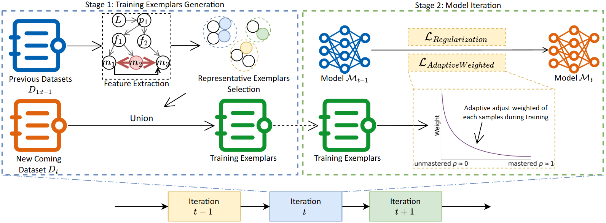

# Ciallo～(∠・ω< )⌒★

  

<em>Ciallo 
(<b>C</b>ont<b>i</b>nual Le<b>a</b>rning of Fau<b>l</b>t <b>l</b>ocalizati<b>o</b>n)</em>

This repository contains the source code for Ciallo along with the configurations for the comparative baseline tools. The README file provides a concise introduction to the Ciallo framework.

> "Ciallo" is a playful portmanteau that combines the Italian greeting "ciao" and the English "hello." 

## workflow

Ciallo comprises two primary phases. In the first phase, we extract program semantics from historical data and perform representative exemplars selection. Specifically, we employ DBSCAN clustering, which eliminates the need to pre-specify the number of clusters. These representative exemplars are subsequently merged with the new dataset to form the training set. In the second phase, we reconstruct the model's loss function using adaptive weights and regularization, enabling the model to acquire new knowledge while effectively mitigating catastrophic forgetting.

## Code

You can find all code in the fold `Ciallo`. In our experiment, we evaluate our method and baselines on a private industrial dataset. As real-world tests contain sensitive information, we cannot release that data. In response, we will endeavor to provide as much detail about the dataset as possible and discuss this threat to validity.

## Configuration of Ciallo and baselines

### Traning parameters

As we utilize Falcon as our base fault localization model, we use the same graph neural network followed by it. Specifically, we apply a gated graph neural network with 6 graph layers.

To prevent underfitting and overfitting due to too few or too many epochs, we use 20 epochs. We maximizez the batch size based on the scale of the graphs to make full use of GPU memory.
In particular, we use a batch size of 10.
We employ Adam optimizer, with a learning rate of 1e-2 and a weight decay of 1e-4. The weight decay is L2 regularization.
The sentenceBERT embedding size is 384.

All baselines utilize the same training parameters and same fault localization backbone (i.e., Falcon).

### REPEAT

For REPEAT, we followed the setup recommanded by the original authors, setting $\lambda$ to 2000 and $\mu$ to 5. We adjusted its K-means parameter to 12 based on our dataset.
